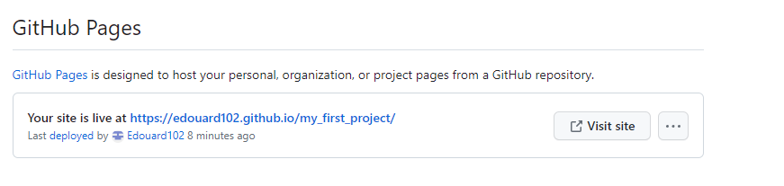

 # **Christophe Arleston**
![responsicemockup]https://ui.dev/amiresponsive?url=https://edouard102.github.io/my_first_project/

The site on Christophe Arleston is an internet page to bring knowledge about this author but also to know his work in the comic strip.
The site is intended for the person who does not know very well the author and who wishes to know more about his work.

## Feature

 ## Navigation

 On the top right we can find the link for the three pages (navigation bar)
It will give you all three pages and easy access. the navigation bar includes links to the homepage, video and newsletter page. it is the same on all pages this will allow the user to easily navigate between pages>

## the footer

Here you will find the different social media links such as Facebook, Instagram, YouTube on Christophe Arleston.
And we will find it on all the pages. for a good homogenisation of the site.

## home 

At the top of the page is the name on the page Christophe Arleston with a photo of him.

The homepage includes 2 images of the different characters he has created as well as a table that gives us information about his marital status
biography section
He tells us what he has done so far. On his professional life.

Next we have three sections which include Christophe Arleston's biography, his bibliography and citations of him through various works.

## The video page.

We find the same layout as on the home page for the page header and footer.

the video allows the user to know more about the author through interviews but also the different projects he has done.
this section gives the user quick and easy access to the video. there is no need to search after on the web.

## The newsletter page.

Gives the possibility to the person to stay in touch with the author's new projects through emails.

## Lanfeust 

This page is made like the home page. We find the same construction for the header and footer. This makes it easier for the good reading of the page.
 
We have four different sections:  Synopsis, Main character, the Universe of Troy and the publication.

In these sections. we will find information on the comic strip.
 this will include images of the characters, places the story, as well as the cover of the different volumes.

## Testing 

I have tried the site on several browsers  and it works correctly.

I have verified that the site is responsive with the deevtoole device toolbar.

## Validator testing

- HTML
  - No errors were returned when passing through the official [W3C validator]
  -
   

- CSS
  - No errors were found when passing through the official [(Jigsaw) validator]

 
 - accessibility

## Bugs

## deployment 
To make this website accessible to the public, Walking Around 
has been deployed on [GitHub Pages](https://pages.github.com/) as follow :

1. Log in to my GitHub account.
    *  You need to sign up on your account[GitHub](https://github.com/).

2. Go to my **Repositories** and select the repository corresponding : [my_first_project](https://github.com/Edouard102/my_first_project).

3. Navigate to **Settings** :

4. Scroll down to the **GitHub Pages** section.
5. Click on the **None** dropdown menu and select the branch to publish : **master**.

6. Click on **Save**.
7. The website is now deployed.

The link to the website is found in the **GitHub Pages** section of the repository settings.

## Credit

### Content :

- [W3schools](https://www.w3schools.com/)  
For general database on software development.

- [George Dimitriadis](https://stackoverflow.com/questions/23968961/css-how-can-i-make-a-font-readable-over-any-color)  
For text-shadow tricks used in css to make text more readable.

- [unused-css.com](https://unused-css.com/blog/css-rounded-table-corners/)  
For tips on vertical alignment in CSS.

- [USERWAY](https://userway.org/blog/html-required-versus-aria-required)  
For explanation on best use of the required attribute.

- [Font Awesome](https://fontawesome.com/)
For the icons taken for the different pages 

 - [code] 
  The code for the navigation and the social media link where take from CI love running project.
  The code for the video was provided by YouTube.
  
- [content] of the different sections we were taken on :
    * (https://www.editions-soleil.fr/)
    * (https://www.babelio.com/)
    * (https://fr.wikipedia.org/wiki/Christophe_Arleston)
    * (https://fr.wikipedia.org/wiki/Lanfeust_de_Troy)
    * (https://www.bdtheque.com/)

This also includes the images used for the site.

python3 -m http.server 